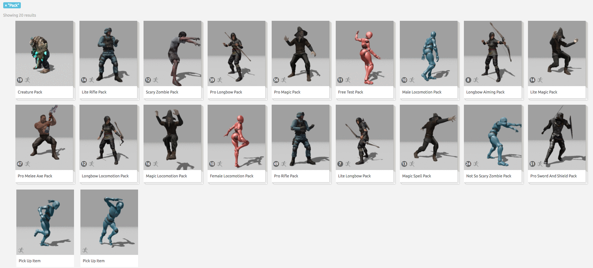

# Mixamo.com 8月22号有变动，不知道好坏，整站下载，先下载为强

# ！只下载动作文件，不下载动作合集！

截至2017年7月16号，官网Store一共有2464个结果


其中18个是官方制作的动作合集，不下载



2464 - 18 = 2446 个动作，完整下载，一个不缺，并且按文件夹放好了


# 使用方法

### 条件
* Chrome
* Tampermonkey 插件
* 非cn地区账号
* [Aria2c下载软件](https://github.com/aria2/aria2)
* 如果账号的My Animations中已经有动作或动作合集，无需删除，因为不会重复添加，动作合集也不会下载

### 准备工作
* Chrome打开[Mixamo.com](https://mixamo.com)
* 登录账号
* 停留在Mixamo.com首页
* 打开Chrome开发者工具的console tab
* 配置脚本文件中的folderPath为存放动作文件的文件夹路径
* 配置Aria2c的连接路径

### 不是无脑复制然后执行，需要一行行命令跟着指示操作
打开Chrome的开发者工具，切换到Console tab
需要具备基本的Javascript基础！
```javascript

// 1
//截至2017年7月16号Store中一共有26页动作，所以取1～26的页数，这是个命令是一波流的操作，会造成网站缓慢。建议分批分页操作
//例如:
//  _.range(1,6).forEach(page=>{GetStoreList(page,AddToAsset)});
//等待所有连接完成后再执行：
//  _.range(6,11).forEach(page=>{GetStoreList(page,AddToAsset)});
_.range(1,27).forEach(page=>{GetStoreList(page,AddToAsset)});


// 2
//切换到Chrome开发者工具的Network tab，等待并观察所有连接都返回200，清空Network记录，再进行下一步。
//现在所有的动作都已经在资源库中了，需要将资源库中的动作添加到下载队列
//切换回到console tab，下面的命令还是建议分批分页执行
_.range(1,27).forEach(page=>{GetAssetList(page,PostToDownload)});
//切换到Chrome开发者工具的Network tab，等待并观察所有连接都返回200，再进行下一步。
//此时所有资源都有下载链接了，需要读取后提交到Aria2c进行下载

// 3
//先获取所有动作的预览图片网址，每个动作两张图片，一张静态的png，一张动态的gif
_.range(1,27).forEach(page=>{ GetStoreList(page,GetStoreItemThumbnail) });
//等候网络连接完成，查看预览图片的总数是否为2446（截至2017年7月16号）
window.Thumbnail.length

// 4
//下载所有动作和动作的预览图片
_.range(1,27).forEach(page=>{ GetAssetList(page,AssetItemDownload) });
//完成

//
```
